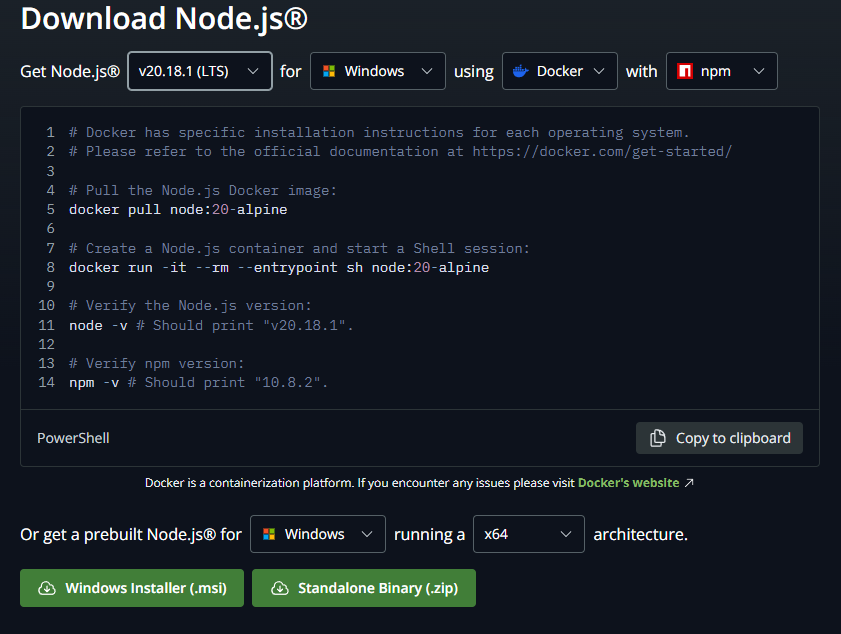

## Github 블로그를 선택한 이유  

Naver 나 Velog 등 블로그 사이트들은 많지만 굳이굳이 Github 블로그가 하고 싶었던 이유는  
  
  1. 마크다운으로 작성 가능
  2. vs code 로 미리보기를 보면서 글 작성 가능
  3. 포스팅할 때마다 잔디가 심어짐!

대충 이정도 이유가 되겠다.  
<br>

Github 블로그에도 여러 종류가 있는데 대표적으로  

&nbsp;&nbsp;&nbsp;&nbsp;Jekyll 기반  
&nbsp;&nbsp;&nbsp;&nbsp;Gatsby 기반

사실 정보 인프라나 테마 다양성은 Jeykll 이 더 좋습니다.  
<br>

널리고 널린 Jekyll 기반 Github 블로그가 아니라 Gatsby 를 선택한 이유는 마음에 쏙 드는 테마가 하필이면 Gatsby 기반 테마였기 때문입니다...  

그리고 이 선택 때문에 오늘 하루를 통째로 날려먹었습니다. (비유가 아니라 진짜 아침부터 점심먹고 저녁까지 개고생함)

중간에 그냥 벨로그로 갈까 고민도 했는데 너무 예쁘고 필요한 기능으로 가득차있어서 포기할 수가 없었습니다...

혹시나 제가 블로그를 꾸준히 운영해서 누군가 이 글을 보게 된다면 저처럼 고생하지 말고 편하게 개설하셨으면 좋겠습니다.

### Getsby 테마 설치하기
Gatsby 테마를 사용하기 위해서는 Node.js 와 gatsby-cli 가 설치되어 있어야합니다.

#### [Node.js 다운로드](https://nodejs.org/en/download/current)

LTS 버전을 선택하고 하단의 Windows Installer (.msi) 를 다운로드 받아서 설치해주시면 됩니다.

### gatsby-cli 설치
설치를 원하는 디렉토리로 이동 후 다음 명령어를 입력해줍니다.
```
npm install -g gatsby-cli
```  

### 원하는 Gatsby 테마 설치
  

저는 [gatsby-starter-hoodie](https://github.com/devHudi/gatsby-starter-hoodie) 라는 테마를 사용했습니다.  

고른 테마를 로컬에 설치하기 위해 아래의 코드를 입력해줍니다.
```
npx gatsby new [만들 사이트] [소스코드 주소]
```

제가 선택한 테마의 경우
```
npx gatsby new my-hoodie-blog https://github.com/devHudi/gatsby-starter-hoodie
```
이런식으로 로컬에 npm 을 이용해 다운받아주시면 됩니다.

### Gatsby 블로그 로컬에서 실행하기

테마 다운로드가 끝났다면 일단 설치한 폴더로 이동해준후
```
cd [폴더 이름]
```
밑의 명령어를 이용해 로컬에서 Getsby 를 실행할 수 있습니다.

```
npm run start
```
이후 브라우저에서 https://localhost:8000 으로 접속하면 로컬에서 실행된 블로그를 확인하실 수 있습니다.  

다음 포스팅에서는 Github Page 를 이용해 블로그 배포를 진행해보도록 하겠습니다.  

<br>

>주의!!  

현재 gatsby-starter-hoodie 테마에 의존성 충돌 이슈가 있습니다.  

`npm run start` 이후  

`Error: Cannot find module 'ajv/dist/compile/codegen'` 해당 오류가 발생한다면  

`npm install --save-dev ajv@^8 --legacy-peer-deps` 으로 의존성 설치 후  

`npm run start` 를 진행해보세요  

[관련 이슈](https://github.com/devHudi/gatsby-starter-hoodie/issues/181)  