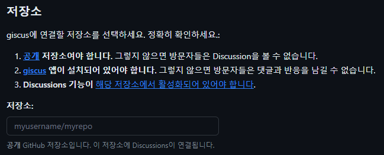

## blog-config.js 작성

```
module.exports = {
  title: "MY BLOG",
  description: "Hello, This is my blog",
  author: "YOUR NAME",
  siteUrl: "https://myblog.com",
  links: {
    github: "https://github.com",
    facebook: "https://www.facebook.com",
    instagram: "https://www.instagram.com",
    etc: "https://www.google.com/",
  },
  giscus: {
    repo: "{YOUR_GITHUB_NAME}/{YOUR_REPOSITORY_NAME}",
    repoId: "{YOUR_GITHUB_REPOSITORY_ID}",
    category: "{YOUR_GITHUB_REPOSITORY_CATEGORY}",
    categoryId: "{YOUR_GITHUB_REPOSITORY_CATEGORY_ID}",
    mapping: "pathname",
    strict: "0",
    reactionsEnabled: "1",
    inputPosition: "bottom",
    lang: "en",
  },
}
```
gatsby-starter-hoodie 는 `blog-config.js` 라는 설정 파일을 제공합니다. 먼저 giscus 설정을 제외한 위쪽 설정을 사용자의 정보로 바꿔주시면 됩니다. 이후 giscus 라는 Git Disscusion 를 기반으로한 댓글 위젯을 설정해주어야 합니다.  
<br>
>Git Disscuss 란?  

G오픈 소스 또는 내부 프로젝트를 중심으로 커뮤니티를 위한 공동 커뮤니케이션 포럼입니다. 

<br>


[giscus 설정 페이지](https://giscus.app/ko)에 들어가서 레포지토리를 조건에 맞게 설정합니다.
  
<br>


Discussion 제목이 페이지`경로`를 포함 을 선택합니다.

<br>


Announcements 유형을 선택합니다.

<br>


이후 생성되는 스크립트에서 

<br>


해당 부분에 있는 repo-id, category, catrgory-id 를 `blog-config.js` 에 작성해주시면 됩니다.